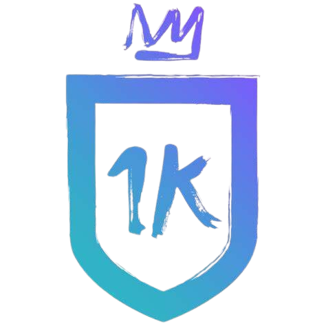

<em"> DESARROLLO WEB </em>
 
<h2 > IKER CASILLAS </h2>


##Descripcion
    <p>
        Trabjo final del curoso de Desarrollo web, en Coderhouse 2024, comision:57655    
    </p>

<h4 >
    :Terminado: Proyecto Terminado :construction:
</h4>


# 🛠️ Abre y ejecuta el proyecto

```
$ git clone https://github.com/Guille1260/TF-Desarrollo-web-acuna.git
$ npm install
$ npm start
```

##Tecnologias utilizadas
```
    html
    css
    boostrap
```
## Autor
<h4 >
    Acuña Guillermo Cesar
</h4>
##lincincia